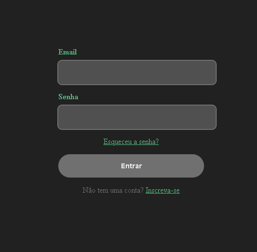
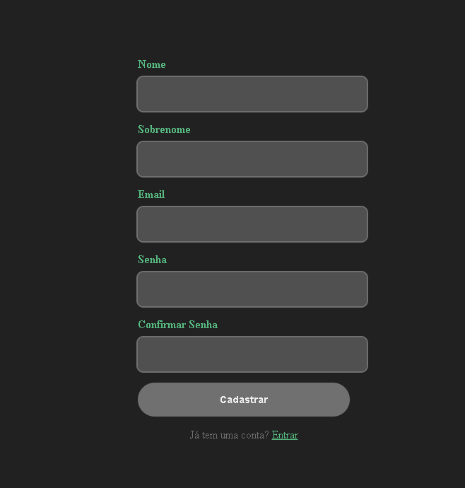
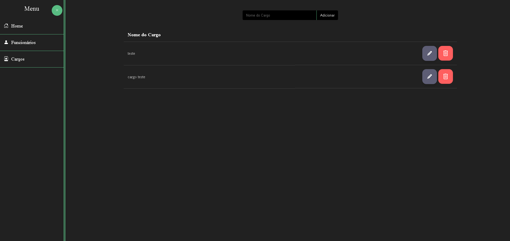
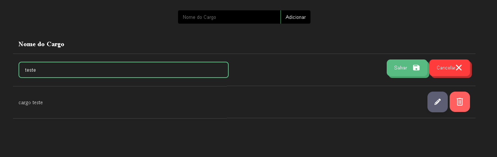
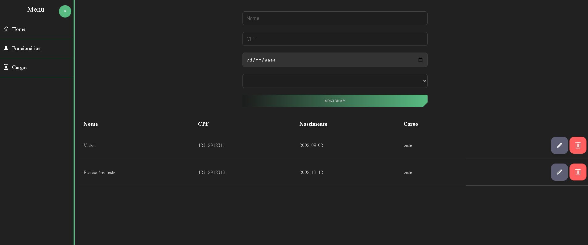
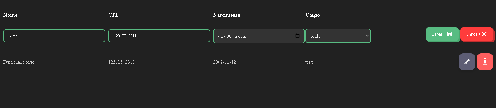
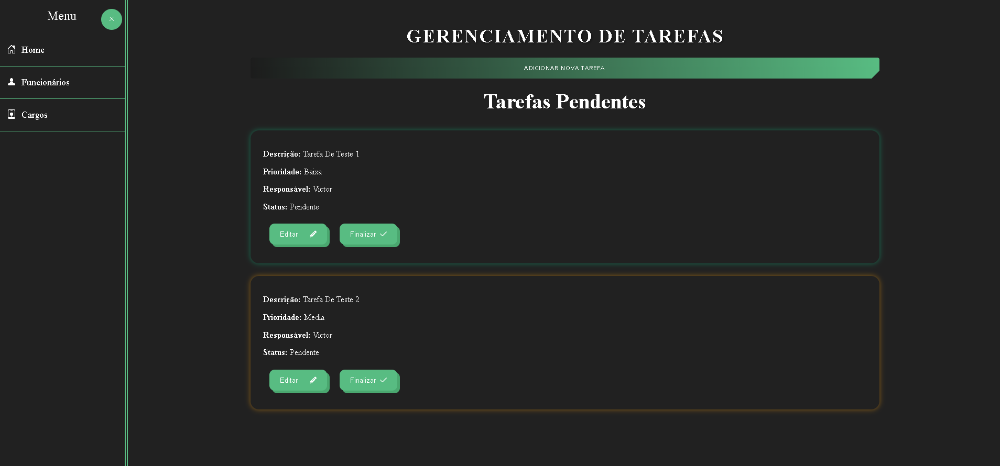
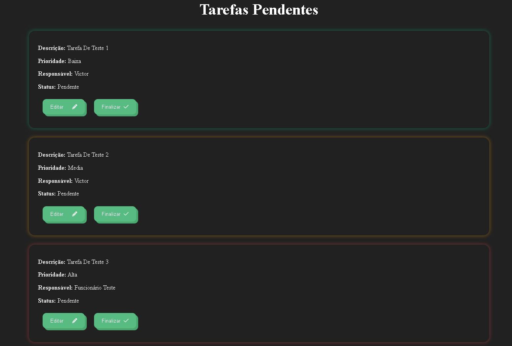
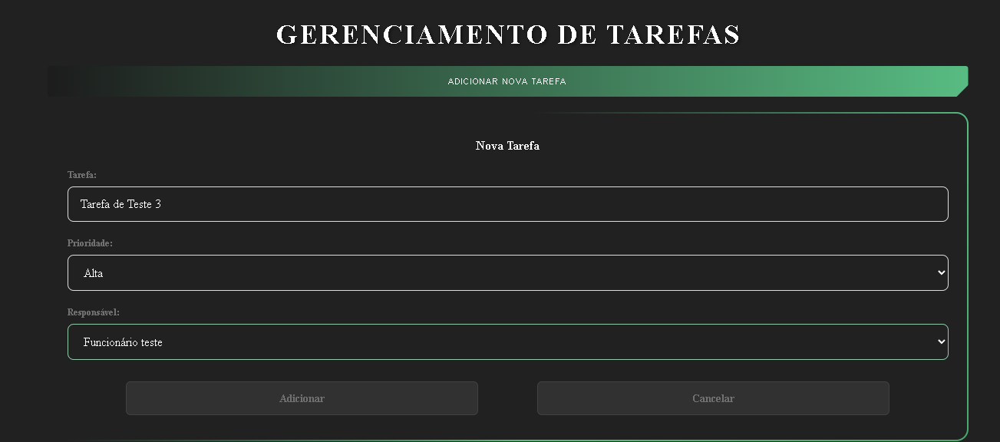
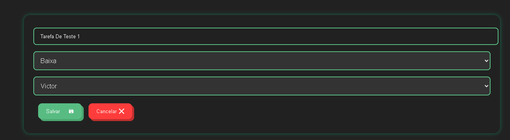

# 💼 Sistema de Gerenciamento Empresarial

> Um sistema completo, intuitivo e funcional para o gerenciamento de tarefas, funcionários e cargos.  
> Pensado para empresas que valorizam eficiência, clareza e controle total na palma da mão.

---

## 🚀 Funcionalidades Principais

### 🔐 Autenticação

- **Tela de Login**
  - Acesso seguro e prático ao sistema.
  - Validação de credenciais com feedback ao usuário.
  - Utilização de JWT (JSON Web Token) no processo de autenticação.

  

- **Tela de Registro**
  - Cadastro de novos usuários de forma rápida e eficiente.

  

---

### 👨‍💼 Gestão de Cargos

- **Tela Inicial de Cargos**
  - Visualização de todos os cargos registrados.
  - Permite editar ou excluir cargos.
  - Exclusão somente permitida se o cargo não estiver vinculado a nenhum funcionário.

  

- **Edição de Cargo**
  - Permite atualizar o nome e os dados de um cargo existente.

  

---

### 👥 Gestão de Funcionários

- **Tela Inicial de Funcionários**
  - Lista completa de funcionários cadastrados.
  - Permite editar ou excluir funcionários.
  - Exclusão somente permitida caso o funcionário não tenha tarefas pendentes vinculadas.

  

- **Edição de Funcionário**
  - Atualização de dados como nome, cargo e demais informações.

  

---

### ✅ Gerenciamento de Tarefas

- **Tela Inicial de Tarefas**
  - Exibe todas as tarefas cadastradas com seus respectivos status.
  - Permite editar ou finalizar tarefas.

  

- **Tarefas Pendentes**
  - Visualização filtrada das tarefas em andamento ou não concluídas.
  - As tarefas são exibidas com bordas coloridas de acordo com sua prioridade.

  

- **Adicionar Nova Tarefa**
  - Interface simples e direta para criação de novas tarefas.

  

- **Editar Tarefa**
  - Atualização das informações de uma tarefa existente.

  

---

## 🛠️ Tecnologias Utilizadas

- **Frontend:** HTML, CSS, JavaScript, Angular.js  
- **Backend:** Node.js, Express  
- **Banco de Dados:** MySQL  
- **Controle de Versão:** Git

---

## 📌 Considerações

Este projeto foi desenvolvido com foco em:

- **Usabilidade**: interfaces intuitivas e agradáveis.
- **Segurança**: autenticação com JWT e controle de acesso por rota.
- **Organização**: estrutura modular e escalável.
- **Responsividade**: adaptado para diferentes dispositivos (desktop, tablet e mobile).

Todas as rotas do sistema foram tratadas com autenticação obrigatória e redirecionamento para rotas inexistentes.

---

<strong>Um sistema desenvolvido com carinho, qualidade e paixão por código! 💙🚀</strong>

